Flowchart (Top-Down, Left-Right, etc.)
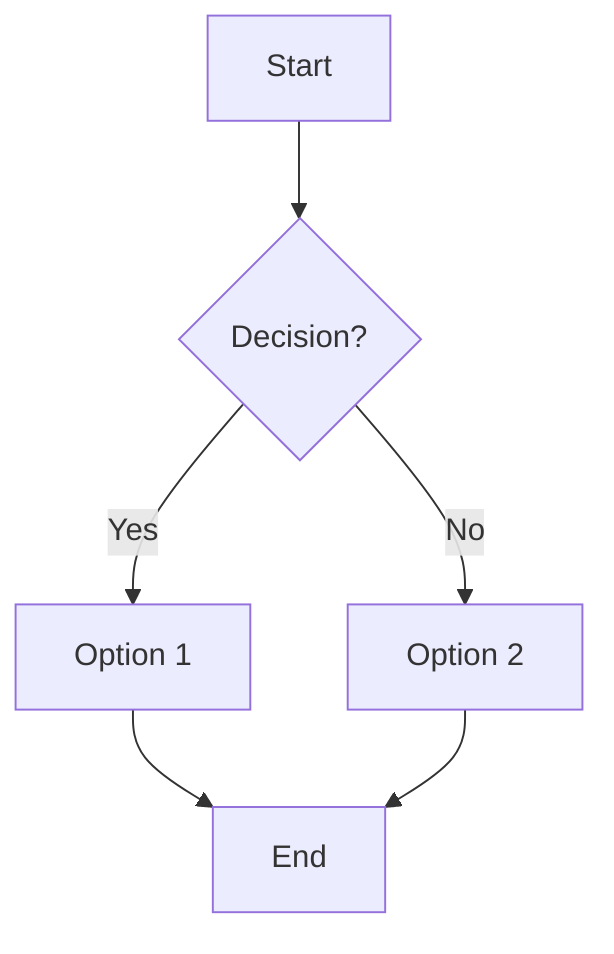

 2.2 Sequence Diagram
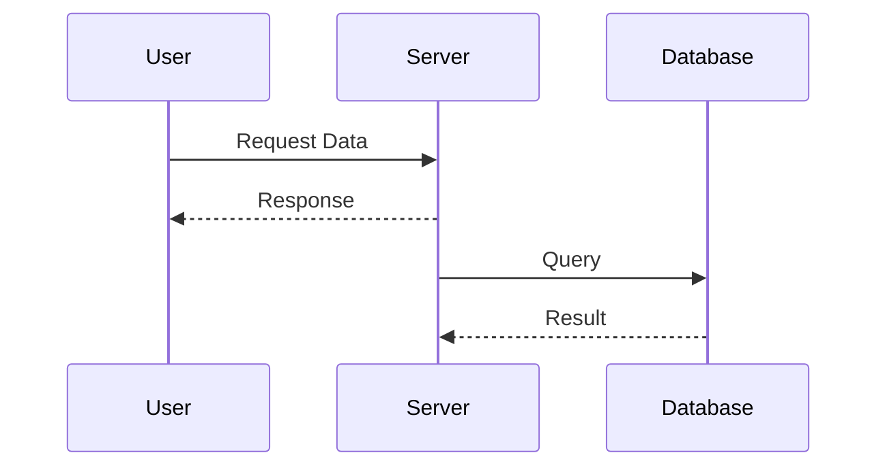

2.3 Gantt Chart
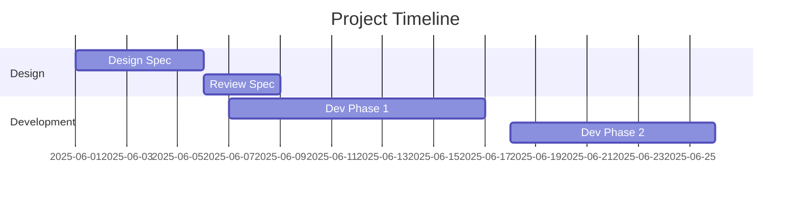

2.4 Class Diagram
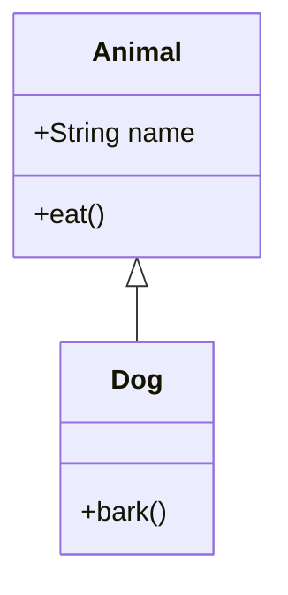

2.5 State Diagram
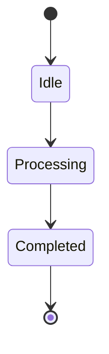


2.6 Entity Relationship Diagram (ERD)
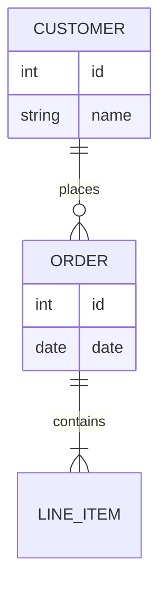

 2.7 Git Graph
 ```mermaid
 gitGraph
    commit
    branch develop
    checkout develop
    commit
    commit
    checkout main
    merge develop
 ```

pie chart
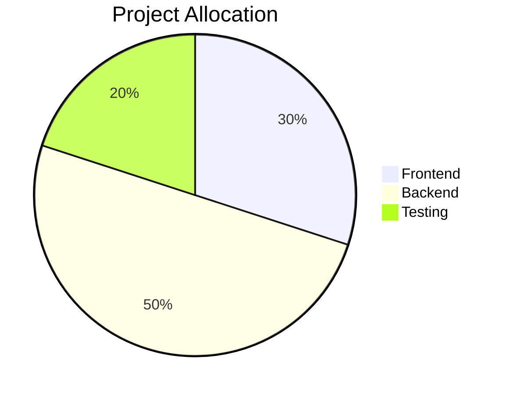

user journey
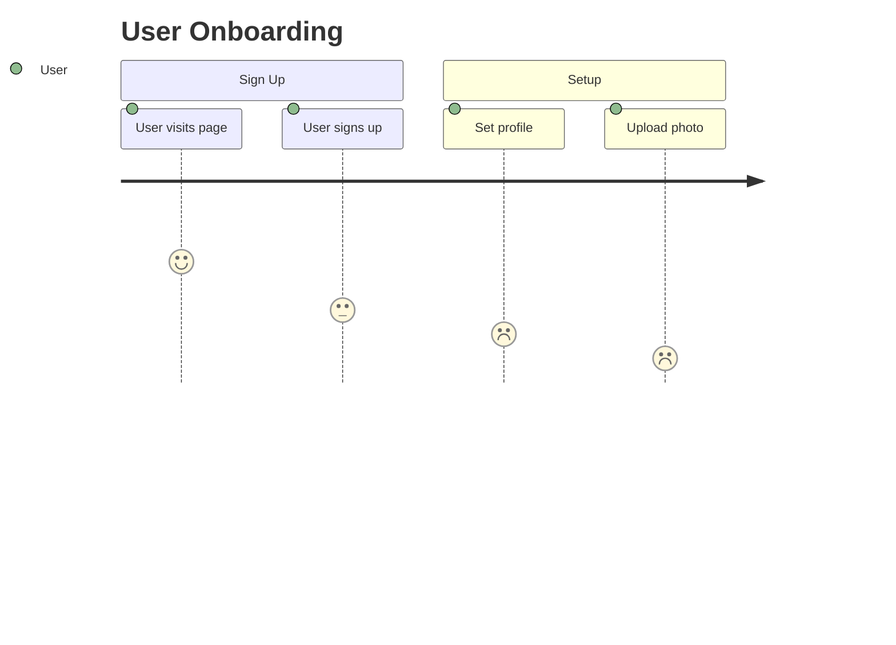

Requirement Diagram 
```mermaid
requirementDiagram
    requirement req1 {
      id: 1
      text: The system shall be fast.
    }
	 requirement req2{
      id: 100
      text: The system shall be fast.
    }
    software - satisfies -> req1
    software - satisfies -> req2
```

	
2.11 Mindmap (in newer Mermaid versions)
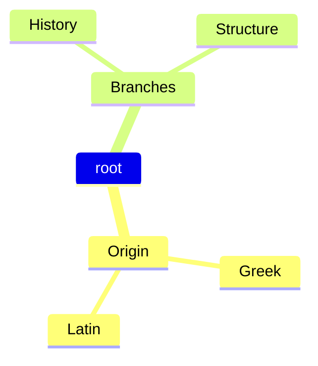

flowchart
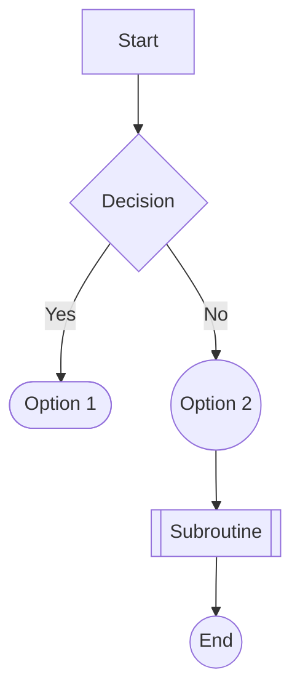

styling node
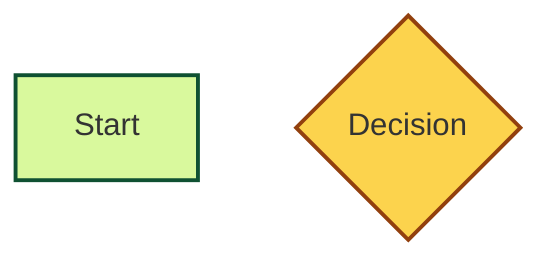

Multi line labels
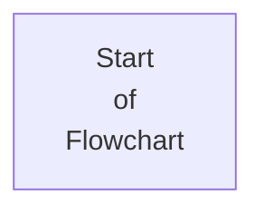

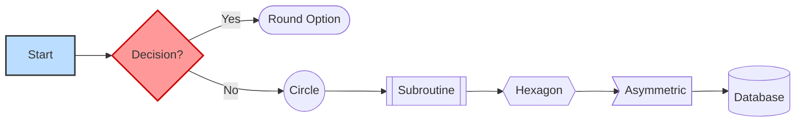
